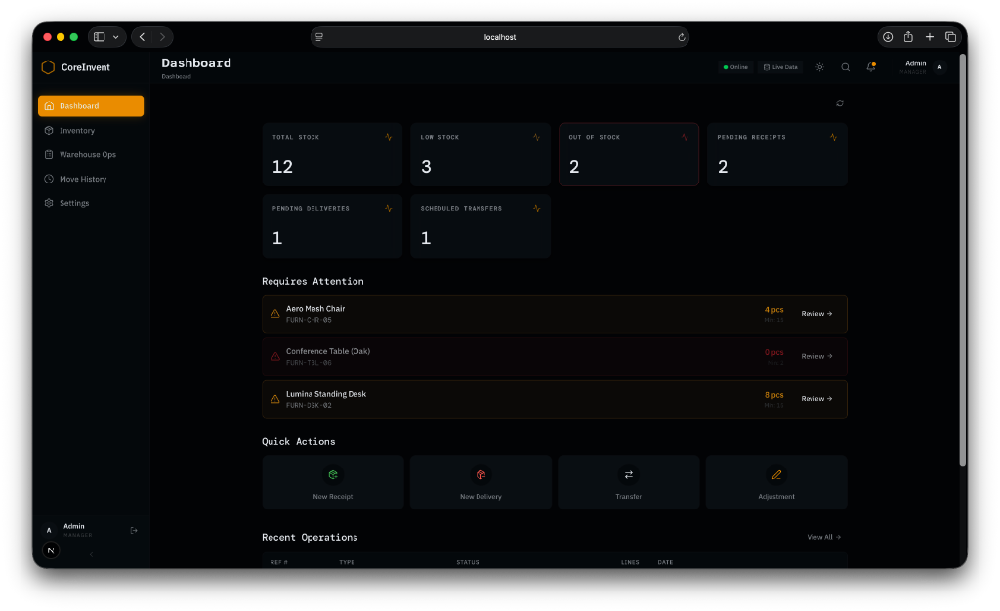
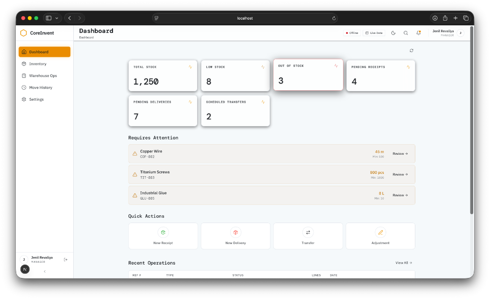
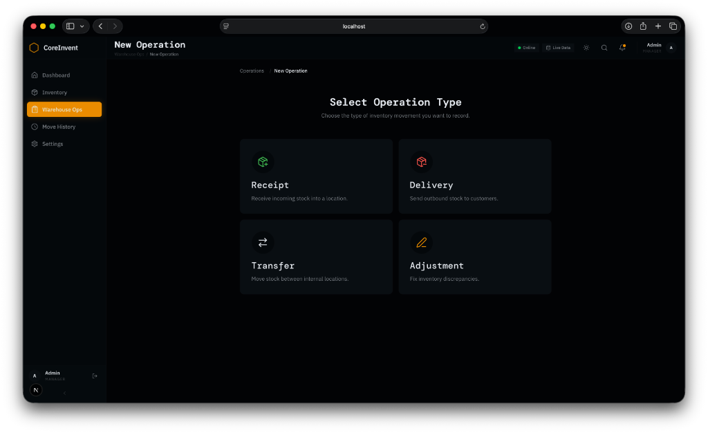
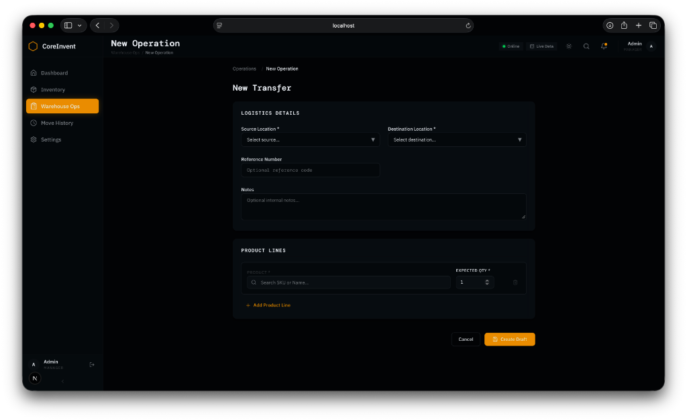
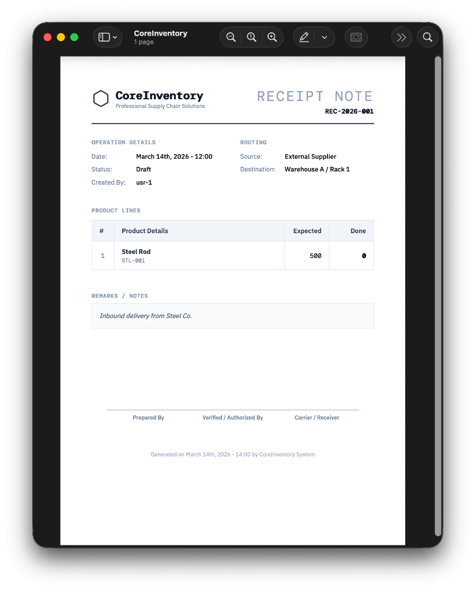

<div align="center">

# ⬡ CoreInventory

### _Enterprise-Grade Warehouse & Inventory Management System_

[](https://nextjs.org/)
[](https://expressjs.com/)
[](https://postgresql.org/)
[](https://redis.io/)
[](https://typescriptlang.org/)
[](https://tailwindcss.com/)

**A full-stack, real-time warehouse operations platform built with a premium glassmorphic UI, dark/light theme switching, and professional PDF receipt generation.**

---



<br/><br/>



<sub>📸 Dashboard overview — switch seamlessly between Dark and Light modes</sub>

</div>

---

## 📖 Table of Contents

- [✨ Features at a Glance](#-features-at-a-glance)
- [📸 Screenshots Gallery](#-screenshots-gallery)
- [🏗️ Architecture](#️-architecture)
- [🖨️ Print Receipt Feature](#️-print-receipt-feature)
- [🌗 Dark & Light Mode](#-dark--light-mode)
- [📊 KPI Dashboard](#-kpi-dashboard)
- [📦 Warehouse Operations](#-warehouse-operations)
- [🛠️ Tech Stack](#️-tech-stack)
- [🚀 Getting Started](#-getting-started)
- [📁 Project Structure](#-project-structure)
- [🔐 API Documentation](#-api-documentation)
- [👥 Contributing](#-contributing)
- [📄 License](#-license)

---

## ✨ Features at a Glance

| Feature | Description |
|---|---|
| 📊 **Real-Time KPI Dashboard** | Animated counters, status-aware cards (healthy/warning/critical), and live stock alerts |
| 🖨️ **Professional PDF Receipts** | One-click print-ready receipts with company branding, signatures block, and routing details |
| 🌗 **Dark / Light Mode** | Seamless theme switching with persistence — your preference is remembered across sessions |
| 📦 **Full Warehouse Operations** | Create Receipts, Deliveries, Transfers, and Adjustments with a guided multi-step workflow |
| 🔍 **Smart Stock Alerts** | Automatic detection of low-stock and out-of-stock items with direct review links |
| 🔄 **Operation Lifecycle** | Draft → Waiting → Ready → Done / Canceled — full status tracking with validation gates |
| 🏭 **Multi-Warehouse Support** | Manage multiple warehouses and storage locations with zone-level granularity |
| 📜 **Move History Ledger** | Complete audit trail of every stock movement with timestamps and user attribution |
| 🟢 **Live Backend Status** | Real-time connectivity monitoring with auto-reconnect and manual ping |
| 🎨 **Glassmorphic Premium UI** | Modern frosted-glass design with subtle gradients, glow effects, and micro-animations |
| 📱 **Fully Responsive** | Optimized for desktop, tablet, and mobile with adaptive navigation |
| 🔐 **JWT Authentication** | Secure login with access/refresh token rotation and role-based access |

---

## 📸 Screenshots Gallery

<div align="center">

### 🏠 Dashboard — Dark Mode


> _Glassmorphic KPI cards with animated counters, low-stock alerts, quick action buttons, and recent operations table._

---

### ☀️ Dashboard — Light Mode


> _Same powerful dashboard in a clean, bright white theme — crystal clear readability._

---

### 📝 Select Operation Type


> _Choose from 4 operation types: Receipt, Delivery, Transfer, or Adjustment. Each with descriptive cards._

---

### 📋 New Transfer Form


> _Complete form with source/destination location pickers, reference numbers, notes, and dynamic product line items._

---

### 🖨️ PDF Receipt Output


> _Professional print template with company logo, operation details, routing info, product lines table, notes section, signature blocks, and timestamps._

</div>

---

## 🏗️ Architecture

```
┌──────────────────────────────────────────────────────────────────┐
│                        CLIENT (Browser)                         │
│  ┌────────────────────────────────────────────────────────────┐  │
│  │              Next.js 16 (App Router + RSC)                 │  │
│  │  ┌──────────┐ ┌──────────┐ ┌──────────┐ ┌──────────────┐  │  │
│  │  │Dashboard │ │Products  │ │Operations│ │  Settings    │  │  │
│  │  │  Page    │ │  CRUD    │ │ Workflow │ │  & Profile   │  │  │
│  │  └────┬─────┘ └────┬─────┘ └────┬─────┘ └──────┬───────┘  │  │
│  │       │             │            │              │          │  │
│  │  ┌────┴─────────────┴────────────┴──────────────┴───────┐  │  │
│  │  │           React Query + Zustand State                │  │  │
│  │  │      (Auth, Backend Status, UI, Theme)               │  │  │
│  │  └─────────────────────┬────────────────────────────────┘  │  │
│  └────────────────────────┼───────────────────────────────────┘  │
└───────────────────────────┼──────────────────────────────────────┘
                            │  REST API (Axios)
                            ▼
┌──────────────────────────────────────────────────────────────────┐
│                      SERVER (Express 5)                          │
│  ┌─────────┐ ┌──────────┐ ┌───────────┐ ┌───────────────────┐   │
│  │  Auth   │ │ Products │ │Operations │ │  Stock Ledger     │   │
│  │  Module │ │  Module  │ │  Module   │ │    Module         │   │
│  └────┬────┘ └────┬─────┘ └─────┬─────┘ └────────┬──────────┘   │
│       └───────────┴─────────────┴────────────────┘               │
│                           │                                      │
│              ┌────────────┼────────────┐                         │
│              ▼            ▼            ▼                         │
│        ┌──────────┐ ┌──────────┐ ┌──────────┐                   │
│        │PostgreSQL│ │  Redis   │ │  Winston │                   │
│        │   15     │ │    7     │ │  Logger  │                   │
│        └──────────┘ └──────────┘ └──────────┘                   │
└──────────────────────────────────────────────────────────────────┘
```

---

## 🖨️ Print Receipt Feature

> **⭐ Highlight Feature** — One of the standout capabilities of CoreInventory.

The system generates **professional, print-ready receipt documents** for every warehouse operation — receipts, deliveries, transfers, and adjustments.

### What Makes It Special:

| Aspect | Detail |
|---|---|
| 🏢 **Company Branding** | Includes the CoreInventory logo and "Professional Supply Chain Solutions" tagline |
| 📋 **Operation Details** | Date, status, created by, and reference number — all clearly formatted |
| 🗺️ **Routing Section** | Shows **Source** and **Destination** locations with human-readable names (not IDs) |
| 📦 **Product Lines Table** | Clean table with product name, SKU, expected quantity, and done quantity |
| 📝 **Notes Section** | Any remarks or internal notes are rendered in a styled block |
| ✍️ **Signature Blocks** | Three signature lines: _Prepared By_, _Verified / Authorized By_, _Carrier / Receiver_ |
| 🕐 **Timestamp Footer** | Auto-generated date/time stamp showing when the document was produced |
| 🖨️ **Clean Print Output** | Sidebar, header, and navigation are automatically hidden — only the receipt prints |

### How It Works:

```
1. Navigate to any operation detail page (e.g., /operations/[id])
2. Click the "Print PDF" button in the action bar
3. The browser print dialog opens with a clean, white receipt
4. Save as PDF or send directly to printer
```

<div align="center">


<sub>↑ Professional receipt with branding • routing • product lines • signature blocks</sub>
</div>

---

## 🌗 Dark & Light Mode

CoreInventory ships with a **premium dual-theme system** powered by `next-themes`.

| | Dark Mode ⬡ | Light Mode ☀️ |
|---|---|---|
| **Background** | Deep OLED blacks (`oklch(10%)`) | Soft paper white (`oklch(98%)`) |
| **Surfaces** | Frosted glass with subtle borders | Clean white cards with light borders |
| **Text** | High contrast warm white | Rich dark grey for readability |
| **Accent** | Warm amber/gold (`oklch(72% 70)`) | Same amber — consistent brand |
| **Persistence** | ✅ Saved to localStorage | ✅ Survives refresh & navigation |

Toggle with a single click on the **☀️ / 🌙 icon** in the header.

---

## 📊 KPI Dashboard

The dashboard provides an **at-a-glance operational overview** with six animated KPI cards:

| Card | What It Shows | Status Indicator |
|---|---|---|
| **Total Stock** | Sum of all products currently in stock | 🟢 Healthy |
| **Low Stock** | Products below minimum threshold | 🟡 Warning (pulse animation) |
| **Out of Stock** | Products with zero quantity | 🔴 Critical (urgent pulse) |
| **Pending Receipts** | Incoming goods awaiting processing | 🟢 Normal |
| **Pending Deliveries** | Outbound orders to fulfill | 🟢 Normal |
| **Scheduled Transfers** | Internal movements in queue | 🟢 Normal |

### Additional Dashboard Sections:

- **⚠️ Requires Attention** — Products that need immediate review with direct navigation links
- **⚡ Quick Actions** — One-click buttons for New Receipt, New Delivery, Transfer, and Adjustment
- **📋 Recent Operations** — Table showing latest operations with reference, type, status, and date

---

## 📦 Warehouse Operations

CoreInventory supports **4 types of inventory operations**, each with a complete lifecycle:

### Operation Types

| Type | Icon | Purpose |
|---|---|---|
| **Receipt** | 📥 | Receive incoming stock from external suppliers into a warehouse location |
| **Delivery** | 📤 | Ship outbound stock to external customers from a warehouse location |
| **Transfer** | 🔄 | Move stock between internal warehouse locations |
| **Adjustment** | ✏️ | Correct inventory discrepancies (count corrections, damage write-offs) |

### Operation Lifecycle

```
  ┌─────────┐     ┌─────────┐     ┌─────────┐     ┌─────────┐
  │  DRAFT  │ ──▶ │ WAITING │ ──▶ │  READY  │ ──▶ │  DONE   │
  └─────────┘     └─────────┘     └─────────┘     └─────────┘
       │                                                 
       │               ┌───────────┐                     
       └─────────────▶ │ CANCELED  │                     
                       └───────────┘                     
```

Each transition is **permission-gated** and updates the stock ledger atomically.

---

## 🛠️ Tech Stack

### Frontend
| Technology | Purpose |
|---|---|
| **Next.js 16** | React framework with App Router and Server Components |
| **React 19** | UI library with latest concurrent features |
| **Tailwind CSS 4** | Utility-first CSS with `@theme` design tokens |
| **Zustand** | Lightweight state management (auth, UI, backend status) |
| **React Query v5** | Server state management with caching and invalidation |
| **Lucide React** | Beautiful, consistent icon library |
| **next-themes** | Dark/Light mode with SSR compatibility |
| **date-fns** | Lightweight date formatting utilities |

### Backend
| Technology | Purpose |
|---|---|
| **Express 5** | HTTP server with middleware pipeline |
| **PostgreSQL 15** | Primary relational database |
| **Redis 7** | Caching and session storage |
| **Knex.js** | SQL query builder and migration runner |
| **JWT** | Authentication with access + refresh tokens |
| **bcrypt** | Secure password hashing |
| **Zod** | Runtime input validation |
| **Winston** | Structured logging |
| **Helmet** | Security headers middleware |

### Infrastructure
| Technology | Purpose |
|---|---|
| **Docker Compose** | Container orchestration for DB + Redis |
| **ts-node-dev** | Hot-reload development server |

---

## 🚀 Getting Started

### Prerequisites

- **Node.js** ≥ 18.x
- **Docker** & Docker Compose (for PostgreSQL + Redis)
- **npm** or **pnpm**

### 1️⃣ Clone the Repository

```bash
git clone https://github.com/JenilRevaliya/odoo_ims.git
cd odoo_ims
```

### 2️⃣ Start Infrastructure

```bash
docker-compose up -d
```

This starts:
- 🐘 **PostgreSQL** on port `15432`
- 🔴 **Redis** on port `6379`

### 3️⃣ Setup Backend

```bash
cd backend
cp .env.example .env
npm install
npm run dev
```

The API server starts on **http://localhost:3001**

### 4️⃣ Setup Frontend

```bash
cd frontend
npm install
```

Create `.env.local`:
```env
NEXT_PUBLIC_API_URL=http://localhost:3001/v1
NEXT_PUBLIC_USE_MOCKS=false
```

```bash
npm run dev
```

The app opens on **http://localhost:3000** 🎉

### 5️⃣ Run Database Migrations

```bash
cd backend
npx knex migrate:latest
```

---

## 📁 Project Structure

```
CoreInventory/
│
├── 📂 backend/                    # Express API Server
│   ├── 📂 src/
│   │   ├── 📂 modules/
│   │   │   ├── 📂 auth/          # Login, Register, Refresh, Forgot Password
│   │   │   ├── 📂 products/      # CRUD + Stock Queries
│   │   │   ├── 📂 operations/    # Receipts, Deliveries, Transfers, Adjustments
│   │   │   ├── 📂 warehouses/    # Warehouse & Location Management
│   │   │   ├── 📂 dashboard/     # KPI Aggregation Queries
│   │   │   ├── 📂 stock-ledger/  # Audit Trail & Move History
│   │   │   └── 📂 profile/       # User Profile Management
│   │   ├── app.ts                # Express App Setup
│   │   └── server.ts             # Entry Point
│   ├── 📂 migrations/            # Knex Database Migrations
│   └── 📂 tests/                 # Jest Test Suite
│
├── 📂 frontend/                   # Next.js Client Application
│   ├── 📂 src/
│   │   ├── 📂 app/
│   │   │   ├── 📂 (auth)/       # Login, Signup, Forgot Password Pages
│   │   │   ├── 📂 (dashboard)/  # Protected Dashboard Routes
│   │   │   ├── globals.css       # Design Tokens + Theme Variables
│   │   │   └── layout.tsx        # Root Layout with Fonts
│   │   ├── 📂 components/
│   │   │   ├── 📂 layout/       # Sidebar, Header, BottomNav, AuthGuard
│   │   │   └── 📂 ui/           # KPICard, Toast, Skeleton, ThemeToggle, Receipt
│   │   ├── 📂 hooks/            # React Query Hooks (useProducts, useOperations...)
│   │   ├── 📂 lib/              # Axios Instance, Mock Data
│   │   ├── 📂 providers/        # QueryClient, Theme, Auth Providers
│   │   ├── 📂 store/            # Zustand Stores (auth, backend, ui, toast)
│   │   └── 📂 types/            # TypeScript Interfaces
│   └── 📂 public/               # Static Assets
│
├── 📂 docs/                      # Documentation & Screenshots
│   └── 📂 screenshots/          # App Screenshots for README
│
├── 📂 shared/                    # Shared Constants & Types
├── docker-compose.yml            # Infrastructure Setup
└── README.md                     # ← You are here!
```

---

## 🔐 API Documentation

### Authentication

| Method | Endpoint | Description |
|---|---|---|
| `POST` | `/v1/auth/register` | Create new user account |
| `POST` | `/v1/auth/login` | Login with email + password |
| `POST` | `/v1/auth/refresh` | Refresh access token |
| `POST` | `/v1/auth/forgot-password` | Request password reset |

### Products

| Method | Endpoint | Description |
|---|---|---|
| `GET` | `/v1/products` | List all products with stock info |
| `GET` | `/v1/products/:id` | Get single product with location breakdown |
| `POST` | `/v1/products` | Create new product |
| `PATCH` | `/v1/products/:id` | Update product details |
| `DELETE` | `/v1/products/:id` | Delete product |

### Operations

| Method | Endpoint | Description |
|---|---|---|
| `GET` | `/v1/operations` | List operations with filters |
| `GET` | `/v1/operations/:id` | Get operation with product lines |
| `POST` | `/v1/operations` | Create new operation (draft) |
| `PATCH` | `/v1/operations/:id` | Update operation details |
| `POST` | `/v1/operations/:id/submit` | Submit for approval |
| `POST` | `/v1/operations/:id/ready` | Mark as ready |
| `POST` | `/v1/operations/:id/validate` | Validate & execute (updates stock) |
| `POST` | `/v1/operations/:id/cancel` | Cancel operation |

### Warehouses

| Method | Endpoint | Description |
|---|---|---|
| `GET` | `/v1/warehouses` | List all warehouses |
| `POST` | `/v1/warehouses` | Create warehouse |
| `GET` | `/v1/warehouses/:id/locations` | List locations in warehouse |
| `POST` | `/v1/warehouses/:id/locations` | Create location |

### Dashboard & Ledger

| Method | Endpoint | Description |
|---|---|---|
| `GET` | `/v1/dashboard/kpis` | Get KPI summary data |
| `GET` | `/v1/stock-ledger` | Get stock movement history |
| `GET` | `/v1/health` | Health check endpoint |

---

## 🎨 Design Philosophy

CoreInventory follows a **premium, enterprise-grade design language**:

- **🪟 Glassmorphism** — Frosted-glass surfaces with `backdrop-blur` and subtle borders
- **✨ Micro-animations** — Counter animations on KPI values, shimmer effects on hover, smooth transitions
- **🎯 Status-driven UI** — Colors react to data state (green = healthy, amber = warning, red = critical)
- **📐 Fluid Typography** — `clamp()` based sizing that scales perfectly from mobile to 4K
- **🖋️ Premium Typography** — DM Mono for headings, IBM Plex Sans for body, IBM Plex Mono for code
- **🧱 Design Tokens** — All colors, spacing, and radii defined as CSS custom properties for consistency

---

## 🤝 Contributing

1. Fork the repository
2. Create your feature branch: `git checkout -b feature/amazing-feature`
3. Commit your changes: `git commit -m 'Add amazing feature'`
4. Push to the branch: `git push origin feature/amazing-feature`
5. Open a Pull Request

---

## 📄 License

This project is built as part of an academic/professional portfolio. All rights reserved.

---

<div align="center">

### Built with ❤️ by [Jenil Revaliya](https://github.com/JenilRevaliya)

_CoreInventory — Where precision meets elegance in warehouse management._

⬡

</div>
