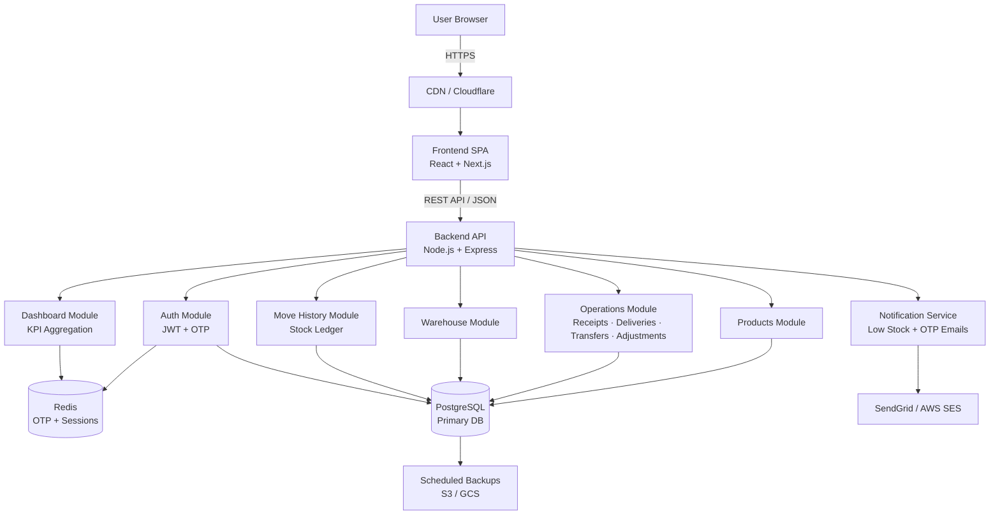
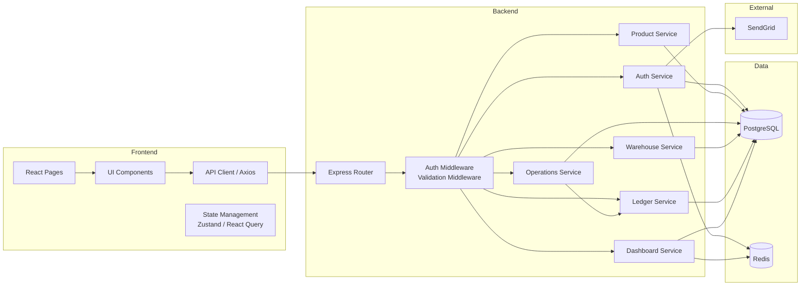
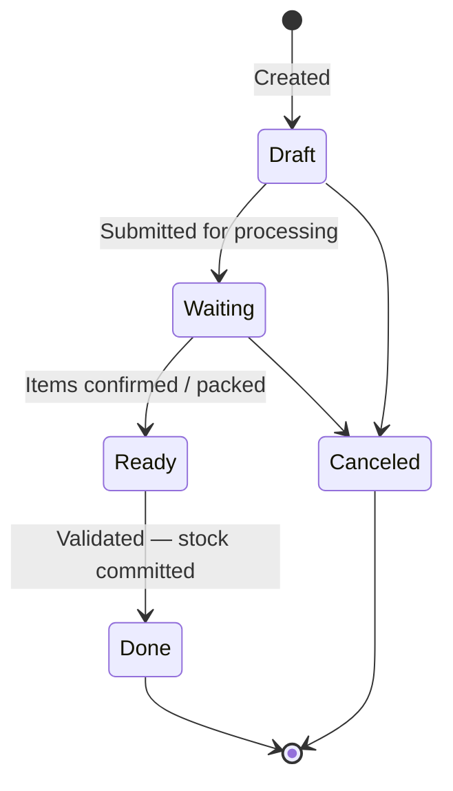
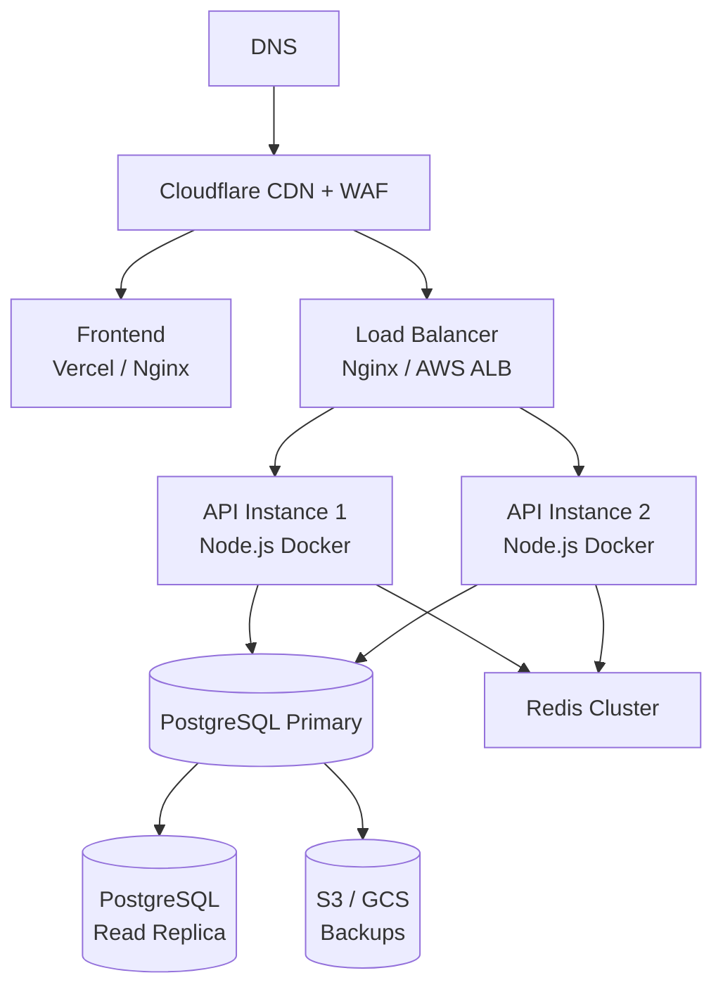

# CoreInventory — System Architecture

> **Version:** 1.0.0 | **Date:** 2026-03-14

---

## Architecture Style

CoreInventory uses a **Layered Modular Monolith** architecture.

The application is a single deployable unit internally organized by bounded domain modules. Each module owns its own routes, service logic, and data access — but all share a single database and runtime.

**Why this style?**

| Reason | Explanation |
|---|---|
| Appropriate complexity | System scope does not warrant microservices overhead |
| Team size | Small-to-medium team; single deploy keeps ops simple |
| Domain isolation | Modules are cleanly bounded — extractable to microservices later |
| Data integrity | Single shared PostgreSQL database allows ACID transactions across modules |
| Low operational cost | One container, one process, simple scaling at MVP stage |

---

## High-Level Architecture Diagram



---

## Layered Architecture (Per Module)

```
┌─────────────────────────────────────────────────┐
│              Presentation Layer                 │
│  React Pages, Forms, Components, State Mgmt     │
├─────────────────────────────────────────────────┤
│           API / Controller Layer                │
│  Express Route Handlers, Request Validation     │
│  Input sanitization, Auth middleware            │
├─────────────────────────────────────────────────┤
│         Service / Business Logic Layer          │
│  Workflow state machine, stock delta logic      │
│  Validation rules, alert triggers               │
├─────────────────────────────────────────────────┤
│           Repository / Data Layer               │
│  ORM queries, SQL abstraction, transactions     │
├─────────────────────────────────────────────────┤
│               Database Layer                    │
│  PostgreSQL tables, indexes, constraints        │
└─────────────────────────────────────────────────┘
```

---

## Component Architecture



---

## Module Responsibilities

| Module | Responsibility |
|---|---|
| **Auth Module** | Sign up, login, OTP generation, JWT issuance, session management |
| **Products Module** | Product CRUD, SKU search, reorder rule management, stock-per-location view |
| **Operations Module** | Orchestrates receipts, deliveries, transfers, adjustments; manages status FSM |
| **Warehouse Module** | Warehouse and location CRUD, location hierarchy |
| **Ledger Module** | Append-only stock movement log; single source of truth for all stock changes |
| **Dashboard Module** | Aggregates KPIs from ledger and balances; cached in Redis for performance |
| **Notification Service** | Sends OTP emails, low-stock alert emails via SendGrid |

---

## Operation Status Finite State Machine



**State rules:**

| State | Who can edit? | Can be validated? | Can be canceled? |
|---|---|---|---|
| Draft | Creator | No | Yes |
| Waiting | Creator | No | Manager only |
| Ready | No one | Yes | Manager only |
| Done | No one | N/A | No |
| Canceled | No one | No | No |

---

## Deployment Architecture



---

## Technology Stack

| Layer | Technology | Reason |
|---|---|---|
| Frontend | React + Next.js | SSR, excellent ecosystem, strong TypeScript support |
| Backend API | Node.js + Express | Fast development, large ecosystem, async-first |
| Database | PostgreSQL | ACID compliance, relational integrity, JSON support |
| Cache | Redis | Fast OTP/session storage and KPI caching |
| Authentication | JWT + bcrypt | Stateless, industry standard, secure |
| Email | SendGrid | Reliable OTP and alert delivery |
| Container | Docker | Reproducible environments |
| CI/CD | GitHub Actions | Native GitHub integration |
| Hosting (MVP) | Railway / Render | Low ops overhead for initial launch |
| Monitoring | Sentry + UptimeRobot | Error tracking + uptime checks |
