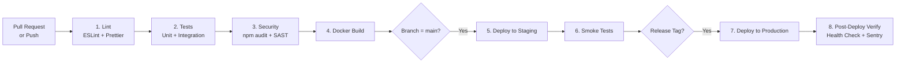

# CoreInventory — CI/CD Pipeline

> **Version:** 1.0.0 | **Date:** 2026-03-14

---

## Pipeline Overview

CoreInventory uses **GitHub Actions** for CI/CD.

Every code push triggers the pipeline. Production deployment requires a tagged release.

---

## Pipeline Stages



---

## GitHub Actions Workflow

```yaml
# .github/workflows/ci-cd.yml
name: CI/CD Pipeline

on:
  push:
    branches: [main, develop]
  pull_request:
    branches: [main]
  release:
    types: [created]

jobs:
  lint:
    runs-on: ubuntu-latest
    steps:
      - uses: actions/checkout@v4
      - uses: actions/setup-node@v4
        with: { node-version: '20' }
      - run: npm ci
      - run: npm run lint
      - run: npm run format:check

  test:
    runs-on: ubuntu-latest
    needs: lint
    services:
      postgres:
        image: postgres:16-alpine
        env:
          POSTGRES_DB: test_db
          POSTGRES_USER: test
          POSTGRES_PASSWORD: test
        ports: ['5432:5432']
      redis:
        image: redis:7-alpine
        ports: ['6379:6379']
    steps:
      - uses: actions/checkout@v4
      - uses: actions/setup-node@v4
        with: { node-version: '20' }
      - run: npm ci
      - run: npm run test:unit
      - run: npm run test:integration
      - run: npm run test:coverage  # Fails if < 80% coverage

  security:
    runs-on: ubuntu-latest
    needs: lint
    steps:
      - uses: actions/checkout@v4
      - run: npm ci
      - run: npm audit --audit-level=high
      - uses: github/codeql-action/init@v3
        with: { languages: javascript }
      - uses: github/codeql-action/analyze@v3

  build:
    runs-on: ubuntu-latest
    needs: [test, security]
    steps:
      - uses: actions/checkout@v4
      - name: Build Docker Image
        run: docker build -t coreinventory-api:${{ github.sha }} .
      - name: Push to Registry
        run: |
          docker tag coreinventory-api:${{ github.sha }} ghcr.io/org/coreinventory-api:${{ github.sha }}
          docker push ghcr.io/org/coreinventory-api:${{ github.sha }}

  deploy-staging:
    runs-on: ubuntu-latest
    needs: build
    if: github.ref == 'refs/heads/main'
    environment: staging
    steps:
      - name: Deploy to Staging
        run: |
          # SSH to staging or trigger Railway/Render redeploy
          curl -X POST ${{ secrets.STAGING_DEPLOY_WEBHOOK }}

  deploy-production:
    runs-on: ubuntu-latest
    needs: deploy-staging
    if: github.event_name == 'release'
    environment:
      name: production
      url: https://coreinventory.io
    steps:
      - name: Deploy to Production
        run: |
          curl -X POST ${{ secrets.PRODUCTION_DEPLOY_WEBHOOK }}
      - name: Verify Health
        run: |
          sleep 30
          curl --fail https://api.coreinventory.io/health
```

---

## Branch → Environment Mapping

| Branch | Environment | Deployment | Trigger |
|---|---|---|---|
| `feature/*`, `hotfix/*` | None | No deploy | PR opened |
| `develop` | None | No deploy | CI checks only |
| `main` | Staging | Auto-deploy | Push to main |
| `release/v*` tag | Production | After staging approval | GitHub Release |

---

## Deployment Checklist (Pre-Production)

```
☐ All CI checks passing (lint, tests, security)
☐ Staging deployed and smoke tests passed
☐ Database migrations reviewed and tested on staging
☐ Environment variables updated/verified in production
☐ Rollback plan confirmed (previous Docker image tagged)
☐ CHANGELOG updated
☐ Stakeholder communication sent
```

---

## Database Migrations

- Migrations managed via **Knex.js** (or Prisma Migrate / Flyway)
- Run **before** new application code is deployed (backward compatible)
- Migration files committed to source control under `/migrations/`
- Automated migration on deploy:
  ```bash
  npm run db:migrate
  ```
- Rollback available:
  ```bash
  npm run db:rollback
  ```

---

## Rollback Procedure

If production deploy causes issues:

1. Identify last stable Docker image tag
2. Trigger redeploy with previous image:
   ```bash
   # Re-tag and redeploy previous image
   docker pull ghcr.io/org/coreinventory-api:<previous-sha>
   # Trigger deploy webhook with previous sha
   ```
3. Run DB rollback if migration was applied:
   ```bash
   npm run db:rollback
   ```
4. Verify health endpoint returns 200
5. Notify team and create incident report
