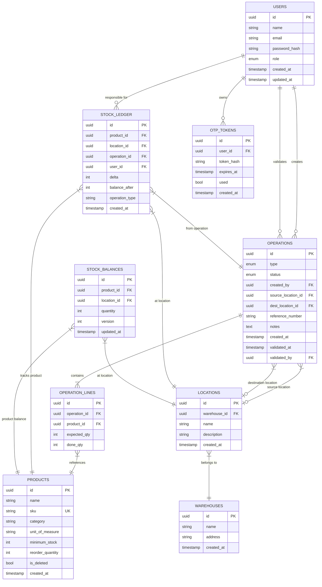

# CoreInventory — Entity Relationship Diagram (ERD)

> **Version:** 1.0.0 | **Date:** 2026-03-14

---

## Full ERD

---

## Relationship Summary

| Relationship | Cardinality | Notes |
|---|---|---|
| User → Operations | One-to-Many | A user creates many operations |
| Operation → Operation Lines | One-to-Many | Each operation has one or more product lines |
| Operation Line → Product | Many-to-One | Many lines can reference the same product |
| Operation → Location (source) | Many-to-One | Optional; used for delivery and transfer |
| Operation → Location (dest) | Many-to-One | Optional; used for receipt and transfer |
| Stock Balance → Product | Many-to-One | One balance record per product per location |
| Stock Balance → Location | Many-to-One | One balance record per product per location |
| Stock Ledger → Product | Many-to-One | Many movements per product |
| Stock Ledger → Location | Many-to-One | Each ledger entry is location-specific |
| Stock Ledger → Operation | Many-to-One | Each ledger entry tied to one operation |
| Stock Ledger → User | Many-to-One | Each ledger entry records the acting user |
| Location → Warehouse | Many-to-One | Many locations per warehouse |
| OTP Token → User | Many-to-One | One user can request multiple OTPs (one valid at a time) |

---

## Key Design Decisions

### Why is `stock_balances` separate from `stock_ledger`?

- `stock_ledger` is the **source of truth** but requires aggregation (SUM) to compute current stock — slow for real-time KPIs
- `stock_balances` is a **performance cache**: always updated transactionally alongside the ledger
- Both are always kept in sync via the atomic validation transaction
- Nightly reconciliation verifies consistency

### Why UUIDs instead of integer IDs?

- UUIDs allow safe distributed ID generation without coordination
- Prevents enumeration attacks (you cannot guess sequential IDs)
- Enables future multi-tenant or multi-database architectures

### Why `is_deleted` on products instead of hard delete?

- Stock history (ledger) references products by FK
- Hard deleting a product would orphan historical ledger records
- Soft delete keeps data integrity while hiding inactive products from UI
