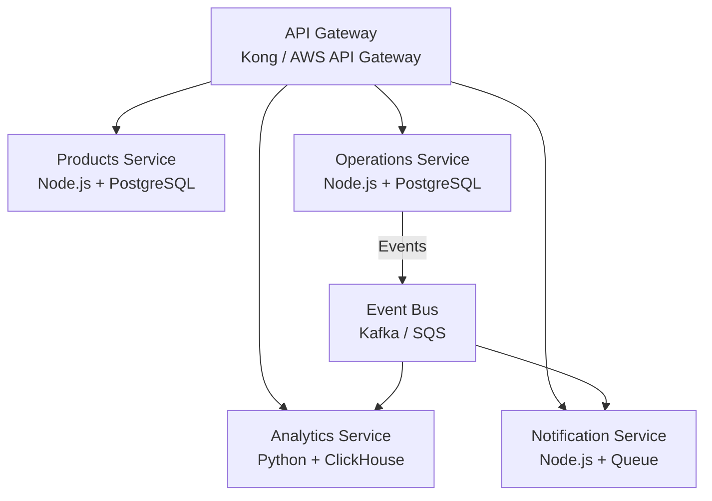

# CoreInventory — Future Improvements

> **Version:** 1.0.0 | **Date:** 2026-03-14

---

## v1.1 — Reporting & Exports (Month 3)

| Feature | Description | Architecture Notes |
|---|---|---|
| **PDF Export** | Export receipts, deliveries, and move history as PDF | Server-side PDF generation (Puppeteer or pdfmake) |
| **CSV Export** | Stock levels and movement history as CSV | Streaming response for large datasets |
| **Email Digest** | Daily stock summary emailed to managers at 07:00 | Cron job + SendGrid template |
| **Dashboard Charts** | Line chart: stock movement volume over 30 days | Use Recharts or Chart.js on frontend |
| **Product Report** | Detailed product page with full movement timeline | Aggregation from stock_ledger |

---

## v1.2 — Supplier Management (Month 4)

| Feature | Description |
|---|---|
| **Supplier Master** | Supplier record with name, contact, lead time, payment terms |
| **Purchase Orders** | Create POs linked to a supplier with expected delivery date |
| **PO → Receipt Link** | Confirming a PO auto-creates a receipt in `Waiting` status |
| **Supplier Performance** | Track on-time delivery rate and quantity accuracy per supplier |
| **Reorder Automation** | System creates draft PO when product falls below `minimum_stock` |

---

## v2.0 — Advanced Operations (Month 5–6)

| Feature | Description | Notes |
|---|---|---|
| **Barcode / QR Scanning** | Scan product SKU barcode to auto-populate operation lines | Web browser camera API + `zxing` library |
| **Mobile-Optimized PWA** | Progressive Web App for warehouse floor tablets and phones | Next.js PWA plugin; offline product lookup |
| **Lot / Batch Tracking** | Associate received goods with a lot or batch number | New `lots` table; ledger entries reference lot_id |
| **Serial Number Tracking** | Track individual high-value items by serial number | High-value inventory use case |
| **Expanded RBAC** | Viewer (read-only), Auditor (read + export) roles | DB migration + middleware update |
| **Email Notifications** | Notify manager when stock hits reorder point | Queue-based notification system |
| **Inline Stock Editing** | Quick-edit stock quantities from the product list view (audit-logged) | Shortcut to adjustment flow |

---

## v3.0 — Intelligence & Analytics (Month 7+)

| Feature | Description |
|---|---|
| **Demand Forecasting** | ML model (or Holt-Winters) predicts future consumption based on delivery history |
| **Dead Stock Detection** | Identify products with no movement in > 90 days; recommend disposal |
| **Reorder Threshold Optimizer** | Suggest optimal `minimum_stock` based on historical lead times and demand |
| **Advanced Analytics Dashboard** | Custom date range reports, pivot tables, multi-dimension filtering |
| **Multi-Company / Multi-Tenant** | Isolated tenant data for group companies sharing one platform |
| **ERP Integration** | Sync with SAP, Tally, or Odoo for financial reconciliation |

---

## Architecture Evolution

### v1.0 → v2.0: Worker Services Extraction

Extract long-running and asynchronous work into separate services:

```
Before (v1.0):
API Server → Direct SendGrid API call (synchronous, blocks request)

After (v2.0):
API Server → Job Queue (Bull/BullMQ + Redis)
         ↑
Notification Worker → SendGrid API
                   → In-app notifications via WebSocket
```

Benefits:
- Email failures don't block API responses
- Workers scale independently
- Retry logic is handled by the queue (not the main API)

---

### v2.0 → v3.0: Microservices Extraction

High-traffic or high-value modules extracted from monolith:



Each service:
- Owns its own database schema
- Communicates via events (not direct function calls)
- Deployable and scalable independently

---

## Technical Debt to Address

| Item | Priority | Notes |
|---|---|---|
| Switch `INTEGER` to `BIGINT` for stock quantities | High | Needed before volumes exceed 2.1 billion |
| Add `archived_at` to ledger rows for cold storage | Medium | After 2-year retention period |
| Implement formal API versioning deprecation process | Medium | Before releasing v2 API |
| Add GDPR-compliant user data export endpoint | High | Before EU expansion |
| Add database query caching at ORM level | Low | After profiling confirms need |
| Replace monolithic `operation_service` with smaller domain services | Low | Natural refactor as modules grow |

---

## Scalability Upgrade Path

| Milestone | Trigger | Action |
|---|---|---|
| > 200 active users | API response p95 > 800ms | Add second API instance; add DB read replica |
| > 5M ledger rows | Query time > 300ms | Partition `stock_ledger` by month |
| > 50 warehouses | Complex multi-warehouse queries slow | Dedicated analytics DB (read replica) |
| > 500 active users | Infrastructure costs rising | Extract `analytics` module to separate Python service |
| Multi-country expansion | Latency from distant users | Multi-region deployment with Cloudflare edge caching |
