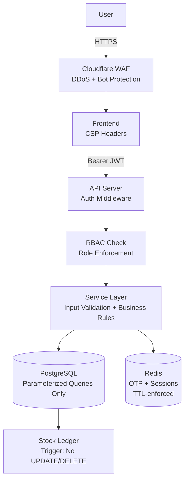

# CoreInventory — Security Architecture

> **Version:** 1.0.0 | **Date:** 2026-03-14

---

## Security Principles

1. **Defense in depth** — security at every layer: network, API, application, database
2. **Least privilege** — users and services have only the permissions they need
3. **Zero trust inputs** — all inputs validated server-side, regardless of client validation
4. **Immutable audit trail** — every stock change permanently logged; cannot be altered
5. **Fail secure** — on unexpected error, deny access rather than allow

---

## Security Architecture Diagram



---

## Authentication Security

See `authentication.md` for full details.

| Control | Implementation |
|---|---|
| Password hashing | bcrypt cost factor 12 |
| JWT algorithm | Explicitly set to HS256 — `"alg: none"` rejected |
| Token storage | Access token in memory; refresh in httpOnly cookie |
| Token expiry | Access: 15 min; Refresh: 7 days |
| Brute force | Rate limit 10/min per IP on `/auth/*` |
| Account lockout | 5 failed logins → 30-minute lockout |
| OTP replay | Single-use flag; 15-minute expiry; 3-attempt limit |

---

## Authorization — RBAC

See `rbac.md` for the full permission matrix.

Role hierarchy: `manager` > `staff`

All role checks are performed **server-side** on every request — never trusted from client.

---

## Input Validation & Injection Prevention

| Threat | Mitigation |
|---|---|
| **SQL Injection** | All queries use ORM parameterized statements — no string interpolation |
| **XSS** | API responses are JSON only; Content-Security-Policy header on frontend |
| **CSRF** | SameSite=Strict cookie + CSRF token for state-changing requests |
| **Mass Assignment** | Only whitelisted fields accepted from request body |
| **Prototype Pollution** | Input parsed and mapped to DTO before processing |
| **Path Traversal** | No file system operations involve user input |

---

## Data Protection

| Layer | Implementation |
|---|---|
| Transport | TLS 1.2+ enforced; HSTS header with 1-year max-age |
| Database passwords | bcrypt cost 12; never returned in API responses |
| OTP storage | bcrypt hash stored; plaintext never persisted |
| JWT secret | Stored in environment variable; rotatable without downtime |
| DB credentials | Environment variables; never in source code |
| Backups | Encrypted at rest (AES-256) in S3/GCS |
| Logs | Passwords, OTPs, and raw tokens never logged |

---

## Stock Ledger Protection

The stock ledger is the most security-sensitive table:

1. **PostgreSQL trigger** raises an exception on any `UPDATE` or `DELETE` statement
2. **Application policy** — no ORM method or repository function issues UPDATE/DELETE on ledger
3. **Code review gate** — any PR modifying the ledger module requires security review
4. **DB user** — application database user does not have DELETE or UPDATE permission on `stock_ledger`

---

## Security Headers

Applied at the API gateway / web server layer:

```http
Strict-Transport-Security: max-age=31536000; includeSubDomains
Content-Security-Policy: default-src 'self'
X-Content-Type-Options: nosniff
X-Frame-Options: DENY
Referrer-Policy: no-referrer
Permissions-Policy: geolocation=(), microphone=(), camera=()
```

---

## Encryption Strategy

| Data | Encryption |
|---|---|
| Passwords | bcrypt (one-way hash) |
| OTP tokens | bcrypt (one-way hash) |
| Data in transit | TLS 1.2+ |
| Backups at rest | AES-256 |
| JWT secret | Stored in secrets manager (not source code) |

**Not encrypted at rest in v1.0** (acceptable given internal use):
- Product names, warehouse names, stock quantities

**Planned for v2.0:**
- Database-level column encryption for sensitive business data if compliance requirements expand

---

## Compliance Considerations

| Requirement | Status |
|---|---|
| Passwords never stored in plaintext | ✅ |
| Passwords never returned by API | ✅ |
| Audit trail for all stock changes | ✅ |
| Audit trail cannot be modified | ✅ |
| Role-based access control | ✅ |
| Secure session management | ✅ |
| GDPR data export (for user data) | 🔲 Planned v1.1 |
| GDPR right to erasure | 🔲 Planned v1.1 (stock history retention complicates this) |
