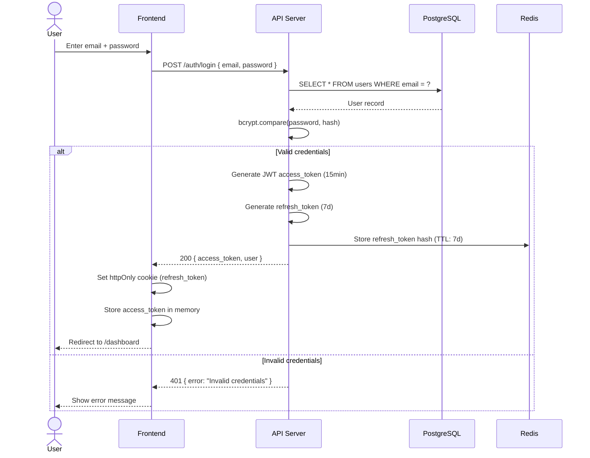
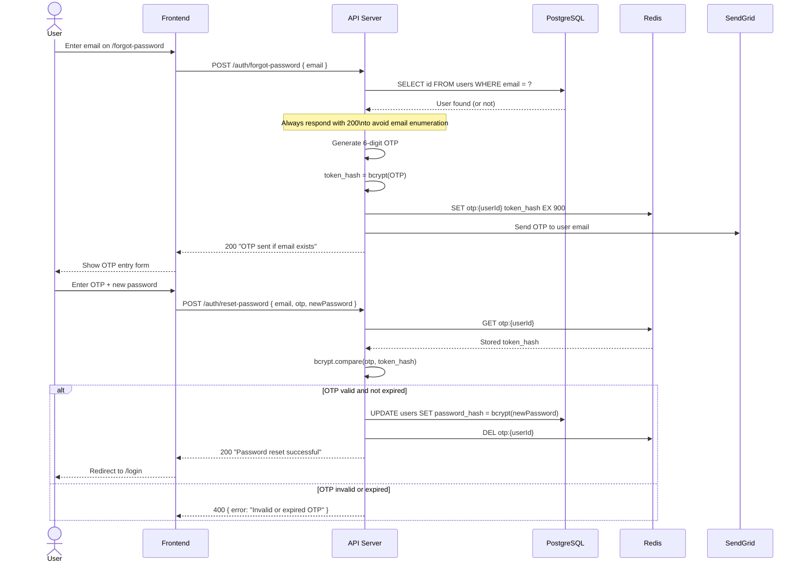
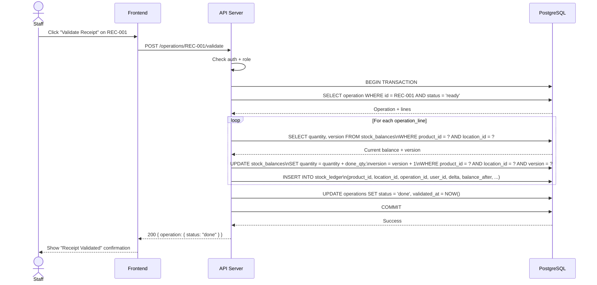
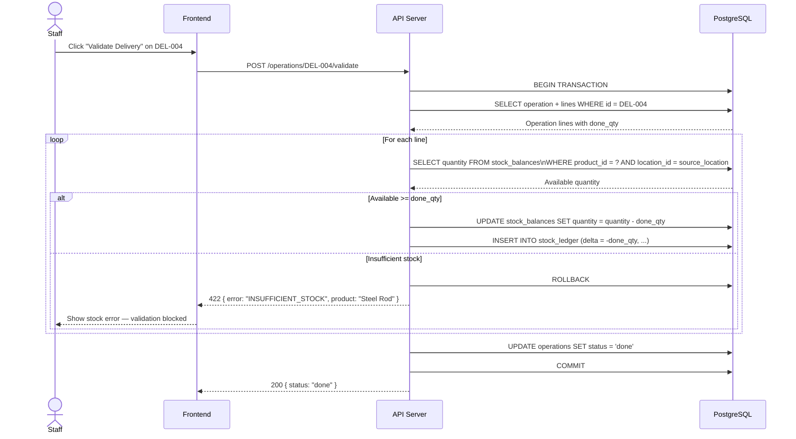
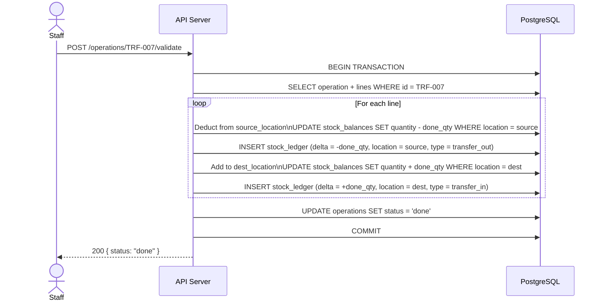
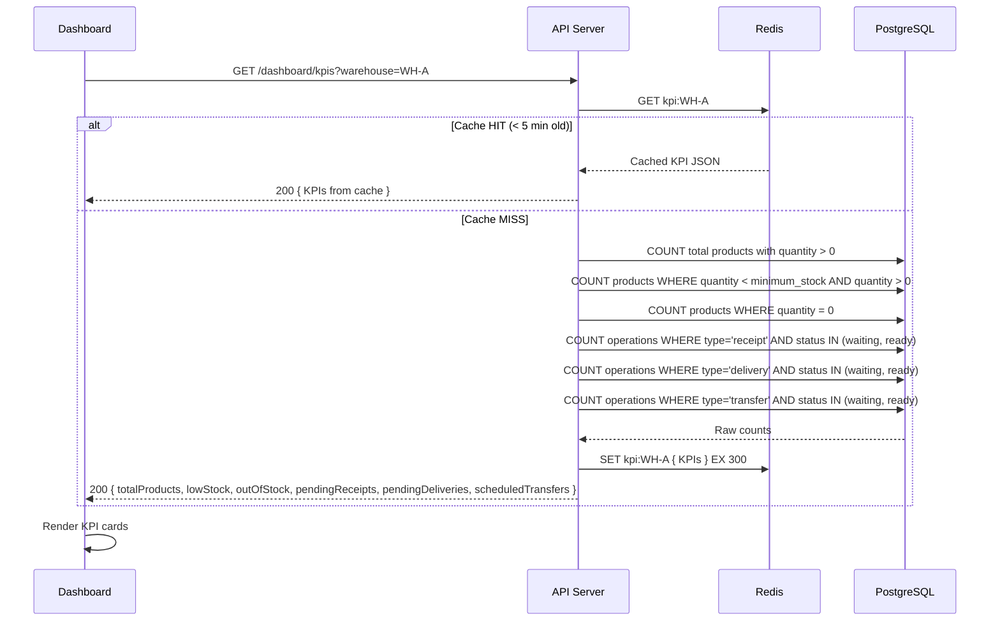
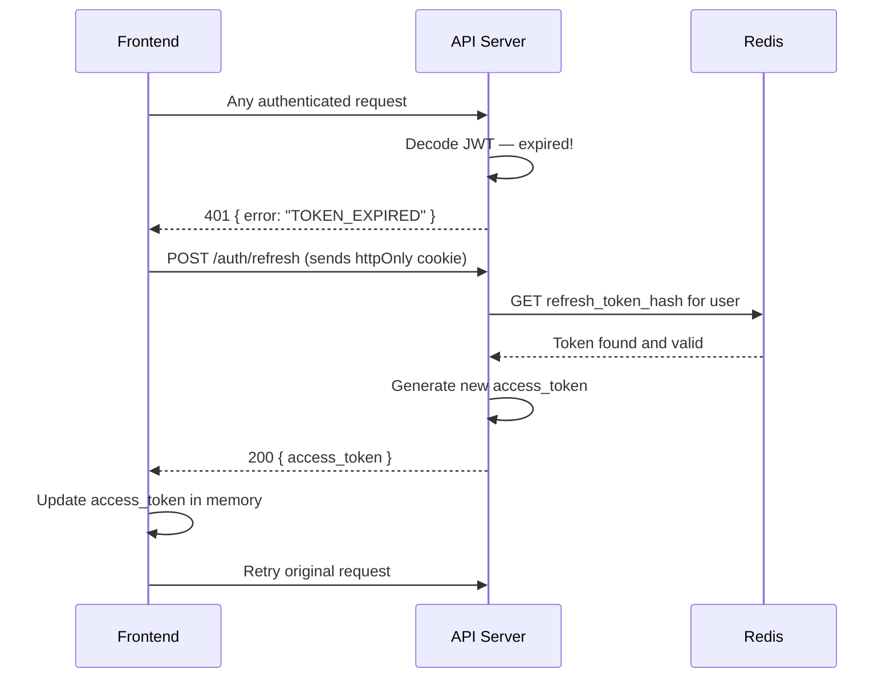

# CoreInventory — Sequence Diagrams

> **Version:** 1.0.0 | **Date:** 2026-03-14

---

## 1. User Login

---

## 2. OTP Password Reset

---

## 3. Receipt Validation (Stock In)

---

## 4. Delivery Validation (Stock Out)

---

## 5. Internal Transfer Validation

---

## 6. Dashboard KPI Load

---

## 7. Token Refresh Flow

