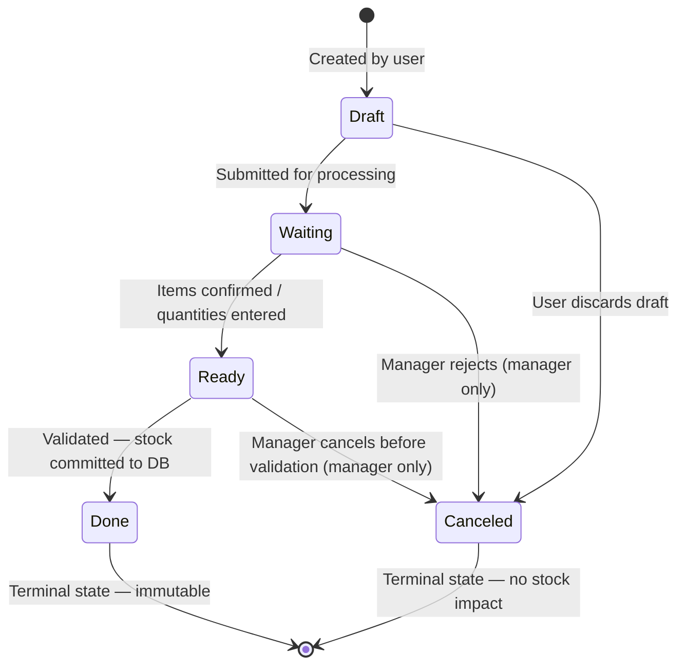
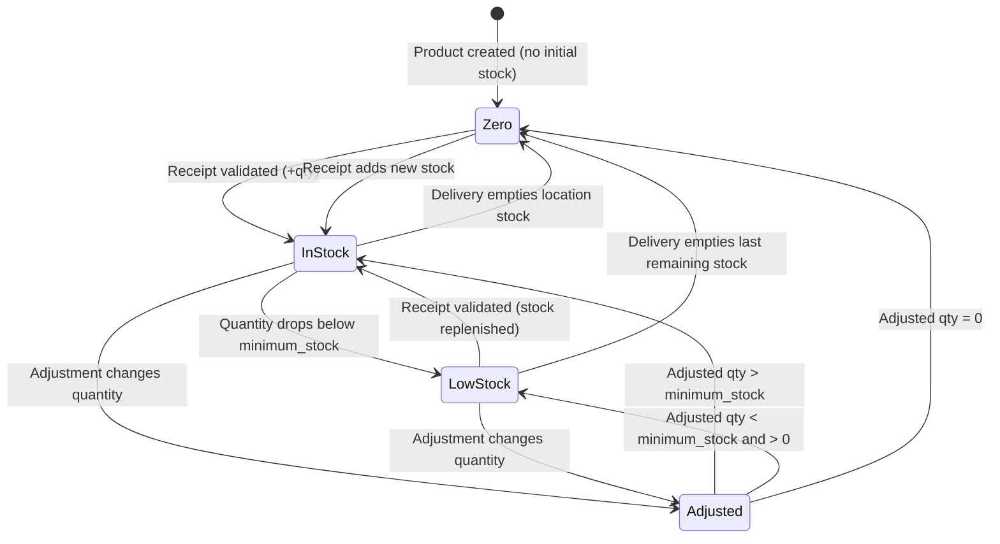
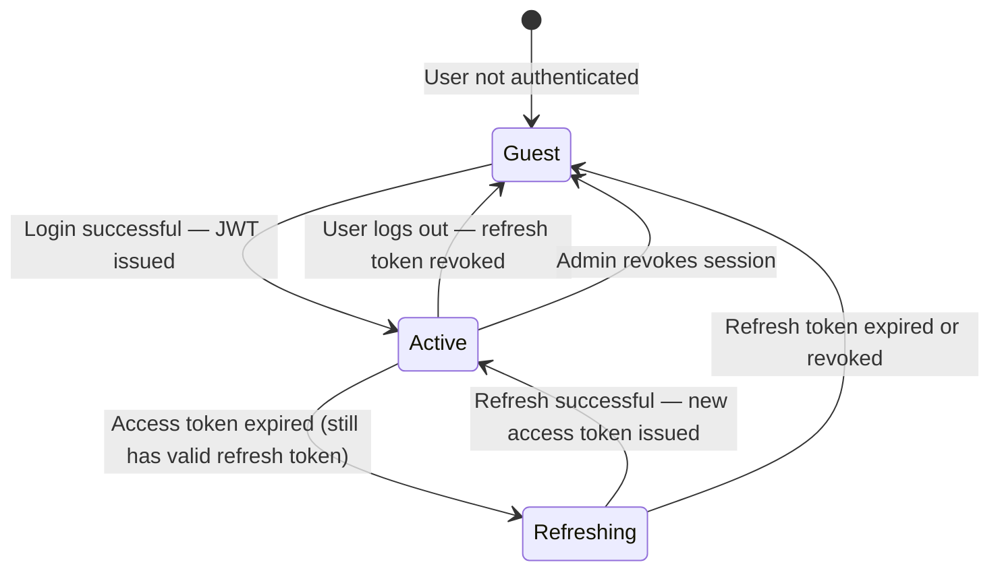
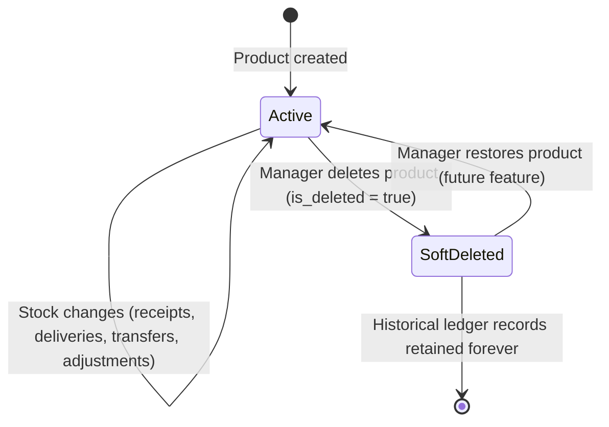

# CoreInventory — State Diagrams

> **Version:** 1.0.0 | **Date:** 2026-03-14

---

## 1. Operation Status State Machine

All operations (Receipts, Deliveries, Transfers, Adjustments) share this lifecycle:

### Status Definitions

| Status | Meaning | Who Can Act |
|---|---|---|
| `Draft` | Created but not submitted | Creator |
| `Waiting` | Submitted, pending confirmation | Creator, Manager |
| `Ready` | Items confirmed, ready to execute | Creator, Manager |
| `Done` | Validated — stock committed | No further action |
| `Canceled` | Terminated without stock impact | No further action |

### Transition Rules

| From | To | Rule |
|---|---|---|
| `Draft` | `Waiting` | At least one operation line required |
| `Waiting` | `Ready` | All `done_qty` values must be filled |
| `Ready` | `Done` | Stock must be available (for deliveries and transfers) |
| `Draft` / `Waiting` | `Canceled` | Any user; manager required for `Waiting` cancellation |
| `Done` | — | No further transitions allowed |
| `Canceled` | — | No further transitions allowed |

---

## 2. Stock Balance State

### Stock State Definitions

| State | Condition | Dashboard Indicator |
|---|---|---|
| `InStock` | `quantity > minimum_stock` | Green |
| `LowStock` | `0 < quantity <= minimum_stock` | Amber — Low Stock Alert |
| `Zero` | `quantity = 0` | Red — Out of Stock |
| `Adjusted` | Intermediate state during adjustment processing | N/A |

---

## 3. OTP Token Lifecycle

```mermaid
stateDiagram-v2
    [*] --> Issued : User requests password reset
    Issued --> Verified : User enters correct OTP within 15 min
    Issued --> Expired : 15 minutes elapsed
    Issued --> Invalidated : User requests a new OTP (old one invalidated)
    Issued --> MaxAttempts : 3 failed verification attempts
    Verified --> [*] : Password updated; token deleted
    Expired --> [*] : Cleaned up by scheduled job
    InvalidAted --> [*] : Replaced by new token
    MaxAttempts --> [*] : Token invalidated; user must request new OTP
```

---

## 4. User Session Lifecycle

---

## 5. Product Lifecycle

> **Note:** Products are never hard-deleted. Historical stock ledger entries reference products by FK. Soft deletion hides the product from UI lists while preserving full audit history.
