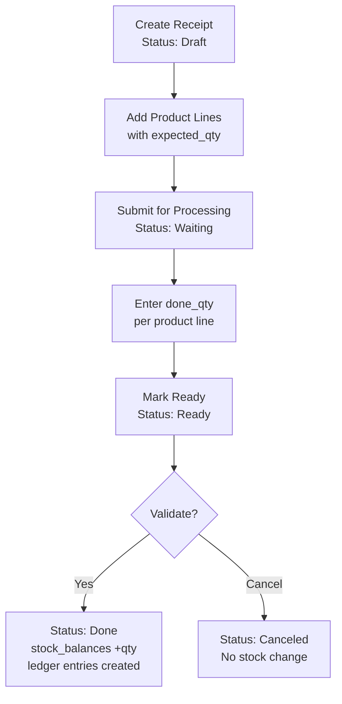
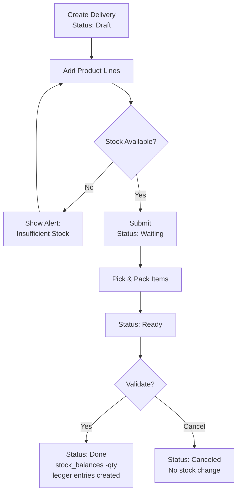
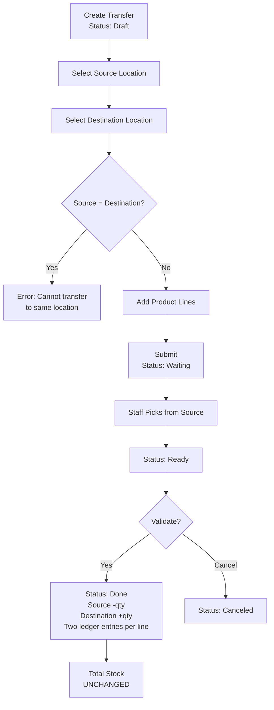
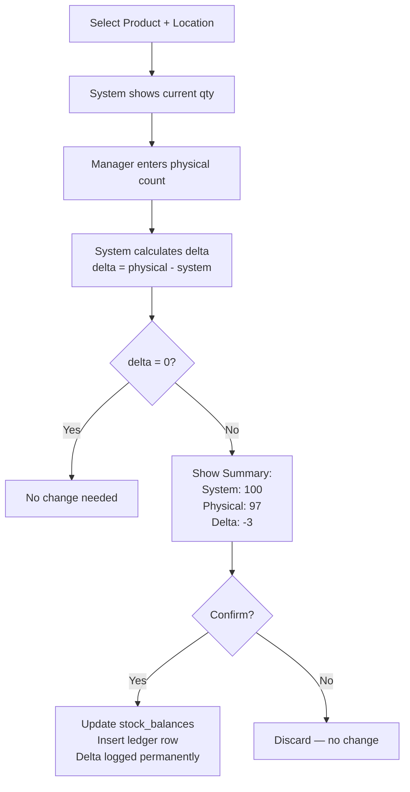
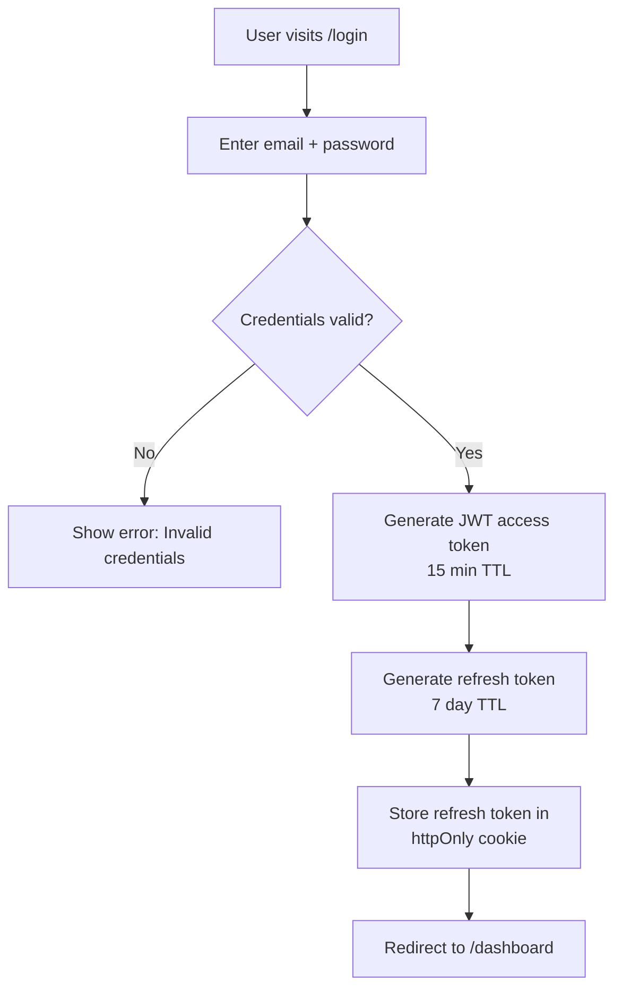
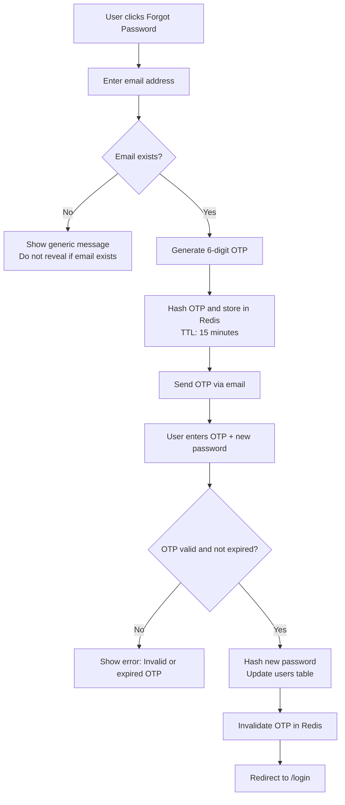

# CoreInventory — Workflows & Process Flows

> **Version:** 1.0.0 | **Date:** 2026-03-14

---

## 1. Receipt Workflow (Incoming Goods)

### Description
A receipt records goods arriving from a supplier, increasing stock at a destination location.

### Steps

| Step | Actor | Action | System Response |
|---|---|---|---|
| 1 | Staff | Create receipt, enter supplier reference | Receipt saved as `Draft` |
| 2 | Staff | Add product lines with expected quantities | Lines saved, receipt stays `Draft` |
| 3 | Staff | Submit for processing | Status → `Waiting` |
| 4 | Staff | Confirm actual received quantities (`done_qty`) | Status → `Ready` |
| 5 | Staff / Manager | Click Validate | Status → `Done`; stock increased; ledger entries created |
| — | Manager | Click Cancel (any stage before Done) | Status → `Canceled`; no stock change |

### Flow Diagram



---

## 2. Delivery Order Workflow (Outgoing Goods)

### Description
A delivery order records goods leaving a warehouse for a customer or destination, decreasing stock.

### Steps

| Step | Actor | Action | System Response |
|---|---|---|---|
| 1 | Staff | Create delivery order, add destination reference | Delivery saved as `Draft` |
| 2 | Staff | Add product lines with quantities to send | System checks stock availability |
| 3 | Staff | Submit | Status → `Waiting` |
| 4 | Staff | Pick and pack items | Status → `Ready` |
| 5 | Staff / Manager | Validate | Status → `Done`; stock decreased; ledger entries created |
| — | Manager | Cancel | Status → `Canceled`; no stock change |

### Flow Diagram



---

## 3. Internal Transfer Workflow

### Description
An internal transfer moves stock from one location to another within the organization. Total stock quantity does not change — only the location distribution changes.

### Steps

| Step | Actor | Action | System Response |
|---|---|---|---|
| 1 | Staff | Create transfer, select source and destination locations | Transfer saved as `Draft` |
| 2 | Staff | Add product lines with transfer quantities | Validation: source ≠ destination |
| 3 | Staff | Submit | Status → `Waiting` |
| 4 | Staff | Pick items from source location | Status → `Ready` |
| 5 | Staff / Manager | Validate | Status → `Done`; source −qty, destination +qty; two ledger entries per line |
| — | Manager | Cancel | Status → `Canceled`; no stock change |

### Flow Diagram



---

## 4. Stock Adjustment Workflow

### Description
An adjustment corrects mismatches between system stock and physical stock counts.

### Steps

| Step | Actor | Action | System Response |
|---|---|---|---|
| 1 | Manager | Select product and location | Current system stock displayed |
| 2 | Manager | Enter physical count | System calculates delta = physical − system |
| 3 | Manager | Confirm adjustment | `stock_balances` updated; ledger entry created with delta |

### Flow Diagram



---

## 5. User Authentication Workflow



---

## 6. Password Reset Workflow



---

## 7. Real-World Inventory Flow Example

This example follows steel rods from arrival to final use:

```
Step 1 — RECEIPT
  Vendor delivers 100 kg steel rods
  Receipt validated → stock_balances +100 at Main Store
  Ledger: +100 | balance_after: 100

Step 2 — INTERNAL TRANSFER
  Move 20 kg from Main Store → Production Rack
  Transfer validated
  Ledger: Main Store -20 | balance: 80
  Ledger: Production Rack +20 | balance: 20
  Total stock: still 100 kg

Step 3 — DELIVERY
  Customer orders 20 kg steel from Main Store
  Delivery validated → stock_balances -20 at Main Store
  Ledger: -20 | balance_after: 60

Step 4 — ADJUSTMENT
  Physical count reveals 3 kg damaged
  Manager adjusts: system = 60, physical = 57
  Adjustment validated → delta = -3
  Ledger: -3 | balance_after: 57

Final: 57 kg at Main Store + 20 kg at Production Rack = 77 kg total
```
