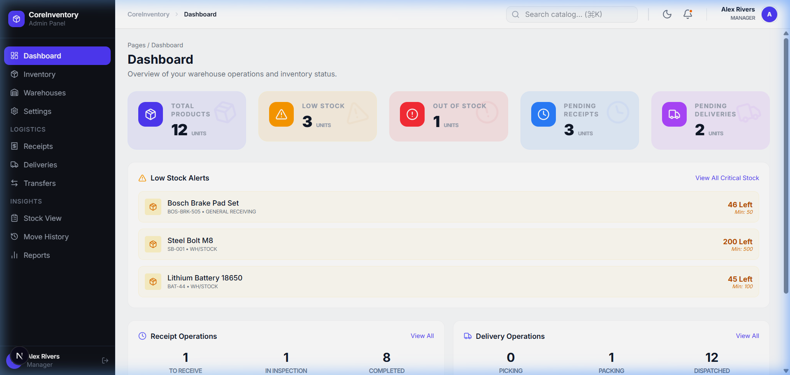
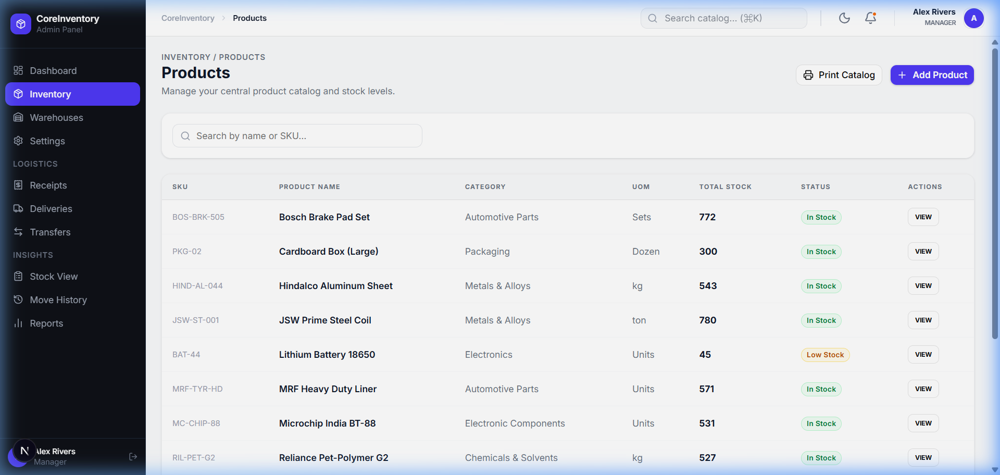
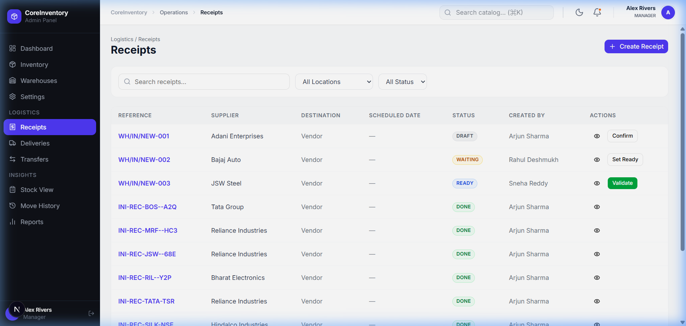

<div align="center">
  <h1>🧵 Stitch (CoreInventory)</h1>
  <p><strong>A Modern, High-Performance Warehouse & Inventory Manager</strong></p>
</div>

---

## 📸 Overview

### 📊 Operations Dashboard
A comprehensive view of your warehouse performance, live KPI stats, and critical alerts.


### 📦 Product Management
Easily browse your catalog, monitor real-time stock across varied locations, and optimize reorder minimums.


### 🚚 Receipt & Operations Tracking
Seamlessly manage goods entering your warehouse with organized operational statuses.


---

## ✨ Key Features
- **Real-Time Analytics**: Dashboard KPIs auto-refresh and display imminent low-stock alerts.
- **Advanced Inventory Ecosystem**: Full tracking of master products, categories, unique locations, and distinct warehouses.
- **Operations Toolkit**: Efficiently manage receipts, inspection queues, picking, packing, and final deliveries.
- **Premium User Experience**: Fast, dynamic layouts with responsive micro-interactions across devices.

## 🛠️ Tech Stack
- **Framework**: [Next.js 16](https://nextjs.org/) (App Router) + [React 19](https://react.dev/)
- **UI & Styling**: [Tailwind CSS v4](https://tailwindcss.com/) + [shadcn/ui](https://ui.shadcn.com/)
- **Database**: [Neon Serverless Postgres](https://neon.tech/) via [Drizzle ORM](https://orm.drizzle.team/)
- **API**: [tRPC](https://trpc.io/) for end-to-end type safety mapped with [React Query](https://tanstack.com/query)
- **Auth**: [Auth.js (NextAuth v5)](https://authjs.dev/)

## 🚀 Getting Started

### Prerequisites
- Node.js `v20` or higher
- A neon database instance (or any compatible PostgreSQL datastore)

### Installation

1. **Setup the Repository**
   ```bash
   git clone <repo-url>
   cd stitch
   npm install
   ```

2. **Environment Variables**
   Create a `.env.local` containing your configurations:
   ```env
   DATABASE_URL="postgresql://[user]:[password]@[host]/[dbname]?sslmode=require"
   AUTH_SECRET="your-generated-auth-secret"
   ```

3. **Database Setup**
   Push the schema to your database and seed it with demo records:
   ```bash
   # Generates schema files
   npm run db:generate

   # Applies schema to the database
   npm run db:migrate

   # Injects initial master-data and demo accounts
   npm run db:seed
   ```

4. **Start the Engine**
   ```bash
   npm run dev
   ```
   *Dashboard now live at [http://localhost:3000](http://localhost:3000)*

---

## 👥 Demo Users

The seeder automatically spins up role-based identities for demoing.

- **Manager**: `manager@coreinventory.com` / `password123`
- **Staff**: `staff@coreinventory.com` / `password123`
